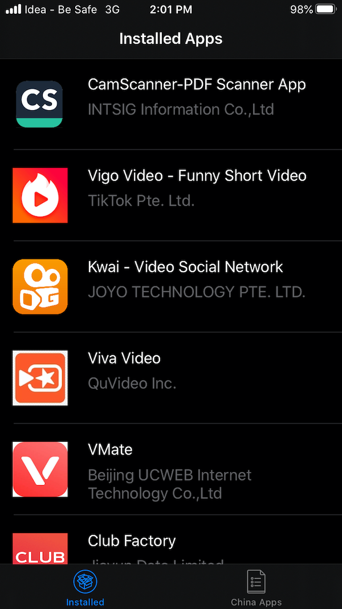

# #Detect and Remove Apps
After popularity of [Remove China Apps](https://play.google.com/store/apps/details?id=com.chinaappsremover) - On the Google Play Store many of my friends where asking for the similar kind of application on iOS.

|  |
| :--: | 

## Just For Fun
This application is being developed for R&D purposes only to identify a certain application(s), I do not want people to uninstall any of the application(s) they are using currently. 

Installed application is not using any private APIs. Based on the prefilled app data it tries to identify the application(s) installed on the device.

I do not guarantee for any correct/wrong information, so users should act only at their own will.  Our application detects and shows the installed application name, icon and the seller. 

#### NOTICE: 
* In case, you delete the application it might delete all the data stored locally in that application on your device.

* All trademarks and/or copyrights and/or patents are the property of their respective owners.  

* If you notice that any content in our app violates copyrights than please inform me so that i remove that content.  

#### Screenshots for you: 

#### FAQ:
* Why not publish this application on AppStore? 

__Answer:__ Apple strict guidelines.

* How does it work?

__Answer:__ Custom URL Scheme
   
#### Credit

Finding the custom URL scheme of an iOS application has been done using iMazing MacOS App.

How to use iMazing app tutorial by  Amer Hukić.
